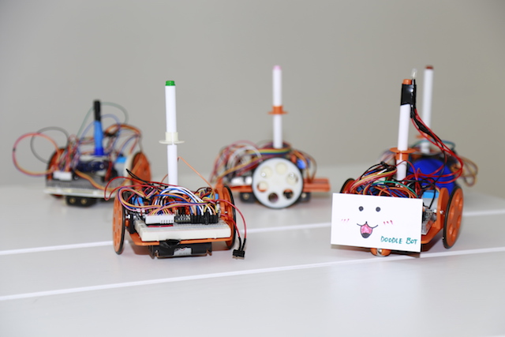

Doodle Bot is a robot-based Creative AI learning platform for High School students. It consists of an introduction to robotics, hardware, arduino programming and machine learning.

Doodle Bot has three main modules : 

* **Construction** : Students learn how to print and construct the robot. Students learn physical fabrication, hardware skills, electronics and circuit design. 
* **Programming** : Students learn how to program the robot to draw different shapes. Students gain Arduino programming skills. Students also learn converting stroke paths to Arduino paths.
* **Training** : Students learn the basics of Machine Learning (Classification, Generative Networks). Students train their robot in ways specific to their project. 

In addition, you can also refer to our [projects gallery](./projects.html) for previous projects, and [resources](./resources.html) to download model files and source code.  

This project is developed and maintained by MIT. Note that the Doodle robot and its training module has been used for robotics and STEM workshop for over 30 high school students in the US and Mexico. 

For any questions and suggestions, please contact : 

* Safinah Ali : safinah@mit.edu
* Nisha Devasia : ndevasia@mit.edu