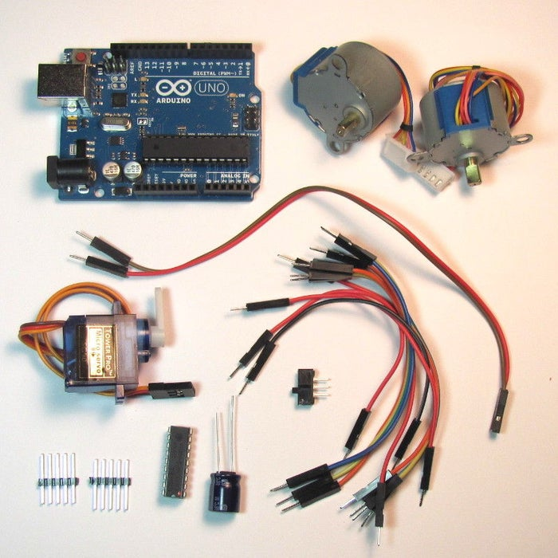
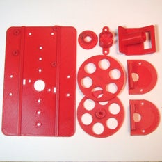
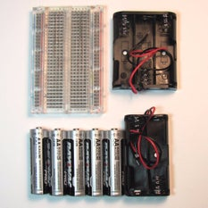
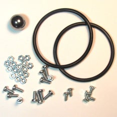
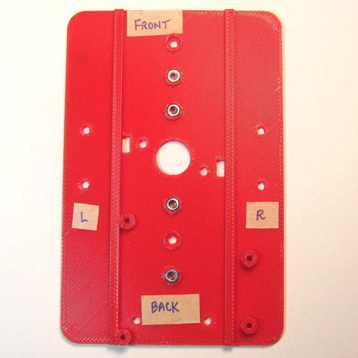
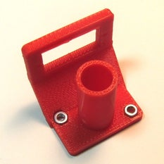
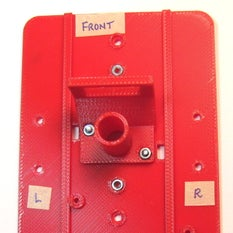
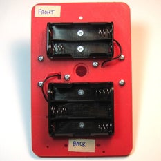

# Make Your DoodleBot!

You can assemble your DoodleBot in just a few steps. 

## 1. Collect parts

First, you will need to gather a few parts.






### Electronics:
* 1x Arduino UNO or equivalent- adafruit.com/products/50
(Adafruit is now the US Manufacture for Genuine Arduinos! Get them from the source.)
* 2x Geared 5V Stepper- adafruit.com/products/858
* 1x ULN2803 Darlington Driver - adafruit.com/products/970
* 1x Half-size breadboard- adafruit.com/products/64
* 12x Male-male jumpers- adafruit.com/products/1956
(At least two should be 6", the rest can be 3".)
* 1x Micro servo- adafruit.com/products/169
* 1x Male pin header- digikey.com/short/t93cbd
* 1x 2 x AA Holder- digikey.com/short/tz5bd1
* 1x-3 x AA Holder- digikey.com/short/t5nw1c
* 1x-470 uF 25V capacitor - www.digikey.com/product-detail/en/ECA-1EM471/P5155-ND/245014
* 1x SPDT slide switch - www.digikey.com/product-detail/en/EG1218/EG1903-ND/101726
* 1x USB micro cable http://amzn.com/B00OC6WR22
* 5x AA Batteries

### Hardware:
* 2x 1 7/8" ID x 1/8" O-ring- mcmaster.com/#9452K96
* 1x Caster 5/8" bearing- mcmaster.com/#96455k58/=yskbki
* 10x M3 x 8mm pan head screw- mcmaster.com/#92005a118/=z80pbr
* 4x M3 x 6mm flat head screw- mcmaster.com/#91420a116/=yskru0
* 12x M3 Nut- mcmaster.com/#90591a250/=yskc6u3D
* 2x 1/4" thread forming 4-20 screws http://www.mcmaster.com/#90380A106

### Printed Parts:
* You can find the parts (both in STL and CAD format) here: https://github.com/mitmedialab/doodlebot/blob/master/parts

### Supplies: 
* Phillips screw driver
* Hot glue gun
* Digital multi-meter
* Sharp knife
* Crayola colored markers

## 2. Test Firmware

Before we get too far into construction, lets load the test firmware on to the microcontroller. The test program just draws for boxes so we can check for proper direction and dimension.

1. Download the Arduino software from www.arduino.cc/en/Main/Software
2. Open the Arduino software.
3. Download the attached zip file and unzip it to the Arduino sketchbook location.
* You can find (or change) this location in the Arduino IDE: [File] -> [Preferences]-> "Sketchbook Location".
4. Load the test sketch: [File] -> [Sketchbook] -> [TIRL_Arduino_TEST]
5. Attach your Arduino to your computer with a USB cable.
6. In the Arduino IDE:
  * Set you board type: [Tools] -> [Board] -> Your board type.
  * Set your serial port: [Tools] -> [Port] -> Usually the last one listed.
7. Upload the sketch using the arrow icon.

If you have any problems, refer to www.arduino.cc/en/Guide/Troubleshooting for help.

## 3. Pen Holder and Battery Holders




<br/><br/><br/><br/><br/><br/><br/><br/><br/><br/><br/><br/><br/><br/><br/><br/><br/><br/><br/><br/><br/><br/><br/><br/><br/><br/>

1. Insert the nuts on the top side of the chassis (Image 1). You may have to press them in.
2. Install the Pen Holder with the Servo Bracket on the top side of the chassis (Image 2 & 3). 
3. Attach the battery holders on the bottom of the chassis using 3Mx6mm flat-head screws (Image 4)
  * You need at least 5xAA to properly power an Arduino via its onboard regulartor. Six would work as well. 
  * You want the weight shifted toward the caster, so put the 3xAA towards the back. 
  * Orient the holders so the leads are closest to the rectangular cable runs. 
4. Thread the battery leads through the rectangular cable runs (Image 4). 
5. Repeat for the other battery holder. 
**Note:** Unless specified, the remainder of the screws are 3Mx8mm pan head screws.

## Step 4. Stepper Brackets


<br/><br/><br/><br/><br/><br/><br/><br/><br/><br/><br/><br/><br/><br/><br/><br/><br/><br/><br/><br/><br/><br/><br/><br/><br/><br/>

1. Insert a nut into the stepper bracket and attach them to the top of the chassis with a screw (Image 1).
2. Insert the stepper into the bracket and attach with screws and nuts.
3. Repeat for the other bracket.

## Step 5. Caster


<br/><br/><br/><br/><br/><br/><br/><br/><br/><br/><br/><br/><br/><br/><br/><br/><br/><br/>

1. Insert the ball bearing into the caster. 
  * Do not force it in or it will break. Use a hair-drier or hot air gun to soften the material if needed.
2. Attach the caster to the bottom side of the chassis in front of the battery holder.
**Note:** If you need a different diameter, you can edit the openScad file (http://www.thingiverse.com/thing:1052674) to fit what ever you have on hand.

## Step 6. Breadboard and Brains


<br/><br/><br/><br/><br/><br/><br/><br/><br/><br/><br/><br/><br/><br/><br/><br/><br/><br/><br/><br/><br/><br/><br/><br/><br/><br/><br/><br/><br/><br/><br/><br/><br/><br/><br/><br/><br/><br/><br/><br/>

1. Remove one of the power rails using a sharp knife, cutting through the bottom adhesive (Image 1).
  * One rail has power (red) on outer edge, they other negative (blue). I'm keeping the first attached, and it will match the schematics and photos. If you use the other, just adjust the wires accordingly.
2. Holding the breadboard over the chassis rails, mark where they intersect the edge (Image 2).
3. Using a straight edge (like the removed power rail), mark the lines and cut through the backing (Image 3).
4. Place the breadboard on the chassis with the rails touching the exposed adhesive (Image 4).
5. Attach the Arduino to the other side of the chassis using 4-20 screws (Image 5).

## Step 7. Capacitor and Part Placement


<br/><br/><br/><br/><br/><br/><br/><br/><br/><br/><br/><br/><br/><br/><br/><br/><br/><br/><br/><br/><br/><br/><br/><br/><br/><br/>

1. Place the darlington driver and power switch on to the bread board (Image 1).
  * I've added orange dots for visibility to mark the following:
    * Pin 1 of the darlington driver
    * The battery pin of the microtroller.The power switch "on" position.
2. Trim the capacitor leads if necessary (longer is negative) (Image 2).
3. Insert the capacitor into the correct rails on the top of the breadboard (Image 3).

## Step 8. Power


<br/>


<br/><br/><br/><br/><br/><br/><br/><br/><br/><br/><br/><br/><br/><br/><br/><br/><br/><br/><br/><br/><br/>

1. With the right-hand battery leads:Connect the red line to the first pin of the power switch (Image 1).
2. Connect the black lead to an empty row between the microcontroller and the darlington chip (Image 1).
3. With the left-hand battery leads:Connect the red line to the same row as the black lead of the other battery (Image 2).
4. Connect the black line to the negative rail of the breadboard (Image 2).
5. Connect power to the microcontroller:
  1. Red jumper from positive rail to the battery pin (orange dot, Image 3).
  2. Black jumper from the negative rail to the pin marked "G" (Image 4).
6. Install batteries and switch the power on (Image 5).
7. You should see the green and red lights of the controller come on (Image 6).

**Troubleshooting:**
  * If the microcontroller lights do not come on, **immediately** turn the power off and troubleshoot:
    * Batteries installed in the correct orientation?
    * Double check battery leads positioning.
    * Double check switch leads positioning.
    * Use a multi-meter to check voltages of batteries.
    * Use multi-meter to check power rail voltages.
    
## Step 9. Stepper Power


<br/><br/><br/><br/><br/><br/><br/><br/><br/><br/><br/><br/><br/><br/><br/><br/><br/><br/><br/><br/><br/><br/>

Now that you've got power to the microcontroller, let's finish wiring power to the steppers:

1. Connect a black jumper from the upper left darlington pin to the negative side of the power rail (Image 1).
2. Connect a red jumper from the lower left darlington pin to the positive side of the power rail (Image
3. Connect a red jumper from the lower left darlington pin to one row right of the darlington (Image 2).
4. Insert pin headers for the stepper's white JST connectors (Image 2).

## Step 10. Stepper Control Signals


<br/><br/><br/><br/><br/><br/><br/><br/><br/><br/><br/><br/><br/><br/><br/><br/><br/><br/><br/><br/><br/><br/><br/><br/><br/><br/><br/><br/><br/><br/><br/><br/><br/><br/><br/><br/><br/><br/><br/>

The microcontroller provides 5 volt signals to the darlington array which in turn, provides VCC to the stepper coils:

1. Start with pin next to the ground pin on the darlington driver, and install orange, yellow, green, and blue wires in that order (Image 1).
2. Attach the jumpers to the following arduino pins (Image 2):
  * 1. orange - Digital pin 4
  * 2. yellow - Digital pin 5
  * 3. green - Digital pin 6
  * 4. blue - Digital pin 7
3. Back at the darlington, continue jumper for the other stepper in the reverse of the others:
  * blue, green, yellow, and orange (Image 3).
4. Attach the jumpers to the following arduino pins (Image 4):
  * 1. blue - Digital pin 9 (pin 8 used latter for the servo).
  * 2. green - Digital pin 10
  * 3. yellow - Digital pin 11
  * 4. orange - Digital pin 12
  
  ## Step 11: Stepper Coil Connections
  
 

<br/>
  
 The stepper's white JST connectors attach to the pin header. The red lead is power, and should match the red power jumpers we installed earlier (Image 1).

All colors should match the microcontroller jumpers on the opposite side of the darlington, with the exception of green, which matches the pink wire of the stepper (Image 2).

## Step 12: Servo


<br/><br/><br/><br/><br/><br/><br/><br/><br/><br/><br/><br/><br/><br/><br/><br/><br/><br/><br/><br/><br/><br/><br/><br/><br/><br/><br/><br/><br/><br/><br/><br/><br/><br/><br/><br/><br/><br/><br/>

1. Install the servo horn with the servo rotated clockwise to the stop and the horn horizontal (Image 1).
2. Attach the servo to the holder, and the horn pointed to the right stepper side (Image 1).
3. Attach brown (ground), red (5V power), and white (signal) jumpers into the servo connector, matching the servo wire colors (Image 2).
4. Attach the power and ground jumpers to the ground and 5V header on the Arduino (Image 3).
5. Connect the white signal wire to the Arduino's Digital Pin 8 (Image 4).

## Step 13: Wheels


<br/><br/><br/><br/><br/><br/><br/><br/><br/><br/><br/><br/><br/><br/><br/><br/><br/><br/>

1. Place the rubber o-ring around the edge of the wheel (Image 1).
2. If the fit of the hub on the axle is loose, you can use a 3M screw to hold it in place (Image 2).
  * Do not tighten it too much or you will strip the plastic.
  
## Step 14: Testing

Hopefully you already uploaded the firmware in Step 2. If not, do it now.

The test firmware just draws a square repeatedly so we can check direction and accuracy.

1. Place your robot on a smooth, flat, open surface.
2. Turn the power on.
3. Watch your robot draw squares.
If you are not seeing lights on the microcontroller, go back and troublshoot power as in Step 8.

If your robot is not moving, double check the power connections to the darlington driver in Step 9.

If your robot is moving erratically, double check the pin connections for the microcontroller and darlington driver in Step 10.

## Step 15: Calibration 


<br/><br/><br/><br/><br/><br/><br/><br/><br/><br/><br/><br/><br/><br/><br/><br/><br/><br/><br/><br/><br/><br/><br/><br/><br/><br/>

If your robot is moving in an approximate square, it is time to put some paper down and put a pen in it.

Measure your wheel diameter (Image 1) and wheel base (Image 2) in millimeters.

Your calibration settings in the code are:
```
float wheel_dia=63;     // mm (increase = spiral out)
float wheel_base=109;   // mm (increase = spiral in)
int steps_rev=128;      // 128 for 16x gearbox, 512 for 64x gearbox
```
I started with a measured wheel diameter of 65 mm and you can see the boxes rotating outward or clockwise each step (Image 3).

I eventually arrived at a value of 63mm (Image 4). You can see that there is still some inherent error due to gear lash and such. Close enough to do something interesting!

## Step 16: Raising and Lowering the Pen


<br/><br/><br/><br/><br/><br/><br/><br/><br/><br/><br/><br/><br/><br/><br/><br/><br/><br/>

We've added a servo, but haven't done anything with it. It allows you to raise and lower the pen so the robot can move without drawing.

1. Place the pen collar on the pen (Image 1).
  * If it is loose, tape it in place.
2. Check that it will touch the paper when the servo arm is lowered.
3. Check that it will not touch the paper when raised.

The servo angles can be adjusted either by removing the horn and re-positioning it, or through the software:
```
int PEN_DOWN = 20; // angle of servo when pen is down
int PEN_UP = 80;   // angle of servo when pen is up
```

The pen commands are:
```
penup(); 
pendown();
```
If you want to use different pen sizes, you will have to modify the pen holder (www.thingiverse.com/thing:1052725) and pen collar (www.thingiverse.com/thing:1053273) with the correct diameter.

## Step 17: Have Fun!

Now it is time to explore. If you look at the test sketch, you will see I have provided you some standard "Turtle" commands:

```
forward(distance);   // millimeters
backward(distance);
left(angle);         // degrees
right(angle);
penup();
pendown();
done();              // release stepper to save battery
```

Using these commands, you should be able to do just about anything, from drawing snow flakes or writing your name. If you need some help getting started, click on the videos below!

The Solution using Standard Markdown ( not iFrame! )
Using an iframe is not the "obvious" solution... especially if the Markdown parser (or publishing platform) you are using does not support inlining content from a different website ... Instead you can "fake it" by including a valid linked-image in your Markdown file, using this format:

[](https://www.youtube.com/embed/unAPCqIWjis "Robots ROCK")

[](https://www.youtube.com/embed/rsgMDhodtPg "Arduino Drawing robot doing random patterns")

## Step 18: Other Platforms


<br/><br/><br/><br/><br/><br/><br/><br/><br/><br/><br/><br/><br/><br/><br/><br/><br/><br/>

*Could this robot be done with a -Insert your favorite board here-?*

Yes! This platform is very flexible. You would mainly just need to modify the chassis.

Above, you can see the robot made with a Raspberry Pi (Image 1) and an Adafruit Trinket (www.instructables.com/id/Low-Cost-Arduino-Compatible-Drawing-Robot/) (Image 2).
